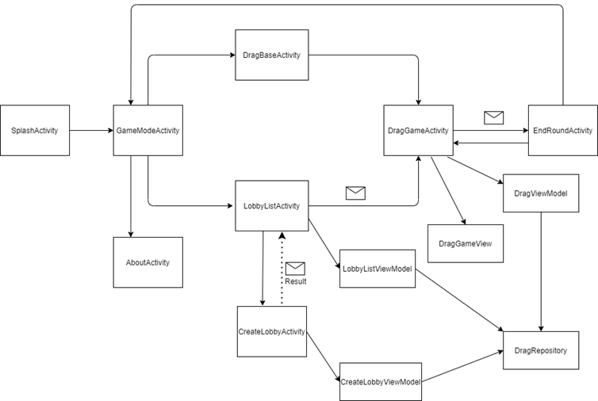

# DRAG DRaw And Guess  

This game is based on a popular [game](http://www.mebo.pt/index.php/pt/catalog/todos-os-produtos/passa-o-desenho) that consists on several players creating a flow of guessing and drawing the word that is shown/written to/by the first player. The objetive is that in the end, the last player guessing guesses rightfully. To fetch words we use an api called [Wordnik](https://developer.wordnik.com/docs). 

## Structure of the application:

